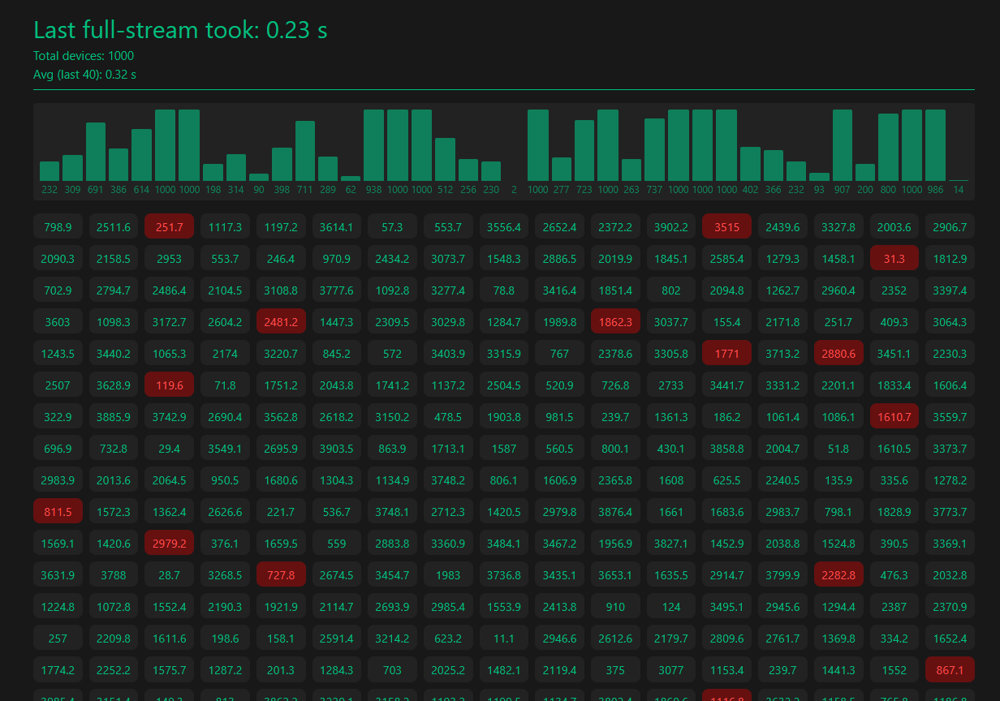

# We have Realtime at Home

> PoC Project, please don't use it in any capacity or run it at all.

This project is a basic test to see how much we can do with a REST server based on Node.js that provides as much data as possible per request while not blocking the thread for file transfer sizes. Since Node.js in general does not like long running transfers, this would only work for horizontal deployed server or with a webserver that supports multple workers per request. The general idea is to simply split the reponse into smaller parts, NDJSON seems to be a good fit for this test.

## NDJSON [repo](https://github.com/ndjson)

Newline‑delimited JSON (NDJSON) emerged in the early 2010s as a pragmatic response to the limitations of traditional JSON when handling large or continuous data streams. While JSON excels at representing complex nested structures in a single document, it forces consumers to wait for the entire payload before beginning to parse. NDJSON addresses this by encoding each JSON object on its own line, using the newline character (\n) as a delimiter. This simple convention preserves full JSON compatibility—each line is valid JSON—while enabling incremental parsing and processing as data arrives.

At its core, the [NDJSON spec](https://github.com/ndjson/ndjson-spec) v1.0.0 from 2013 defines that a stream of data be formatted as follows: one JSON object per line, without enclosing brackets or commas. This design allows servers to emit records as soon as they become available, and clients to parse them immediately, avoiding buffer bloat and high memory usage. Because each record is self‑contained, error handling is localized: a malformed line can be skipped or logged without invalidating the entire stream.

Using JavaScript fetch with streaming capabilities turn NDJSON into a powerful tool for responsive applications. By calling fetch() and accessing the `response.body` as a readable stream, developers can use a `TextDecoder` and a ReadableStreamDefaultReader to read chunks of text, split on newline boundaries, and `JSON.parse()` each complete line as it arrives. This technique lets applications start rendering data—such as live logs, analytics, or user‑generated content—almost instantly, rather than waiting for a full JSON array. The result is significantly reduced waiting times, smoother user experiences, and more efficient resource utilization on both client and server.

## Run the Simulation

### Development

> Don't forget to install the packges in the server and consumer directories first. You can do that with `cd <dir> && npm install`.

```bash
npm run dev
```

### With Podman

```bash
npm run podman:start
npm run podman:stop
```

### Stats

Checkout the consumer log e.g. from the podman output, there is the number of processed messages + the deltatime.

Example:

```log
Processed 53 devices in chunk
Processed 19 devices in chunk
Processed 29 devices in chunk
Processed 15 devices in chunk
Processed 39 devices in chunk
Processed 30 devices in chunk
Processed 10 devices in chunk
Processed 19 devices in chunk
Processed 24 devices in chunk
Processed 5 devices in chunk
Processed 77 devices in chunk
Total devices processed: 10000
Delta since last full update: 0.61s
```

## Web Consumer

This part is just a small vue app to test the streaming capabilities from a visual client. The app allows two configuration params via .env files.

| Param | Desc | Example |
|-------|------|---------|
| VITE_API_BASE_URL| The URL to the server component. | VITE_API_BASE_URL=<http://boblab:5000> |
| VITE_STREAM_DELAY_MS | A aritifical time delay between full request cycles. | VITE_STREAM_DELAY_MS=200 |
| VITE_STREAM_COUNT | Number of devices to request from the server. | VITE_STREAM_COUNT=100 |

### Run / Dev

```bash
cd web-consumer
npm install
npm run dev
```

### Example


